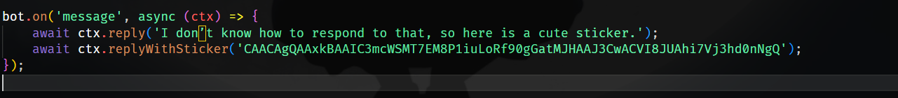
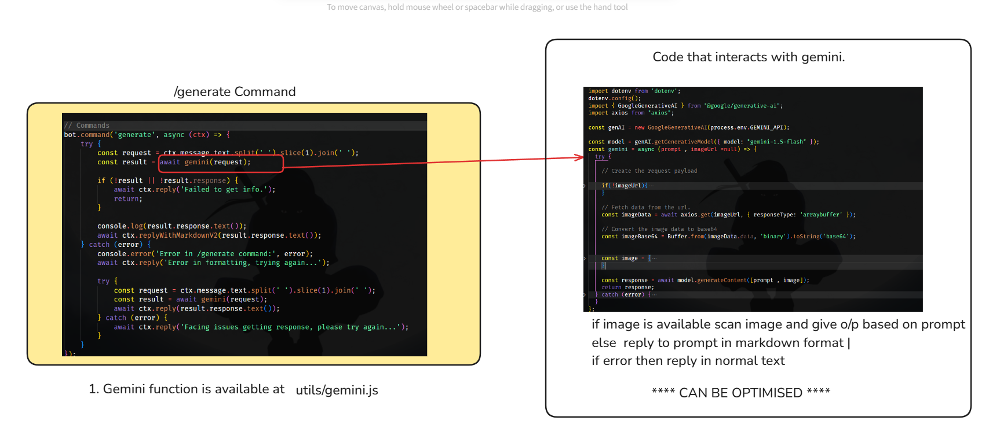

# Nerdy-Bot (for Your Daily Needs.) 

# Documentation 

### 1. Dependencies:
1. Telegraf.js : https://telegraf.js.org/
2. Google Gemini Model
3. Mongoose (ODM by MongoDB).
4. React (Yet to build MiniApps for the same. )
---
### 2. Models
- User Model : [userModel](./model/user.js) - Name , id etc data of users 

- Task Model : Specific user's tasks stored in tasks Model.

---
## Steps to the code. 
1. Goto [api/webhook.js](./api/webhook.js)

On starting the bot , user's data is available to us through ctx or context provided by `telegraf.js ` we store that data in user model.

2. There's commands and actions for the particular commands , go through code you'll understand it easily
`Example ` : On Sending a random message the bot with perfom actions defined (in our case it'll reply with a message and sticker) 


3. ###  `/generate command`

- Code for Gemini interaction : [click here](./utils/gemini.js) 

4. ### `/tasks` Command :
- Simply take text as input 
- Store that text in tasks model .
- `getAllTasks` to get all tasks.


## Possible Functions And Optimisations
1. First Biggest optimisation we can do is **(by providing/ maintaining
context)** of a specific user / chat History.(that must retain for a user for a particular time)

2. **User can subsribe to contest notifications** :
- One can scrap data from https://clist.by/ and notify user's about
some of the most popular constasts 1hr or 1 day before the contest begins. with proper links.

3. **Help user Track their progress** : Provides a summary of user's tasks/data or coding profiles 

4. **Using MiniApps (by react)** : For an improved UI/UX.

5. **Writing Content** : 
- Get command as `/idid something` , and store it on some ididDB (mongoDB )
- Now after users send `/summarizeMyDay` Command: Based on that data generate content for linkedin / twitter or other social media apps. (can use gemini for same).

## **Free Will**
- Help us brainStorm more ideas ! More features that'll make it a really useful thing rather than just a gemini wrapper.

(use the power of coding - infinite api's already written there , infinite no. of possibilites. ) 

**Let's do it !!!** **LFG 🚀🚀🚀🚀🚀**


----

## How to clone? (without webHooks? aka local machine)
1 `git clone https://github.com/nerdyabhi/telegram-bot-nodejs`


2. Write `npm i` command and install all the dependencies

3. Create a `.env` file and add your corresponding API's 

```js
TELEGRAM_BOT_API = xxx-xx-xx 
MONGO_URL =  xxx-xxx-xxx
GROQ_API  = xxx-xxx-xxx
GEMINI_API = xxx-xx-xx
```

4. `npm run dev` and voila !!


- Made with 💖 by [Nerdy Community]


